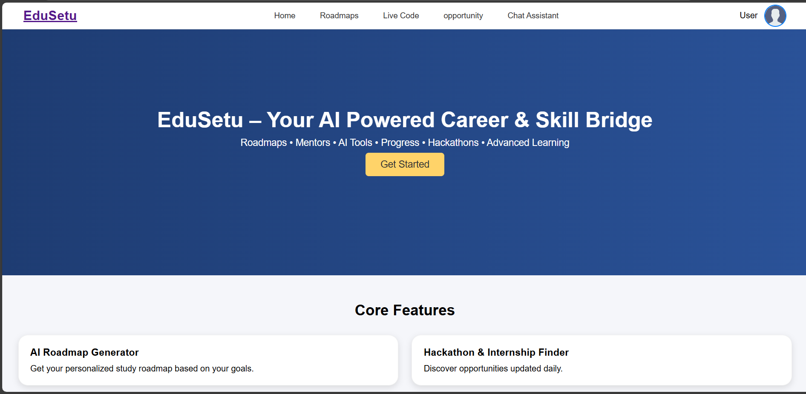
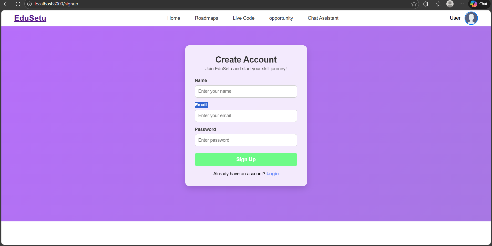
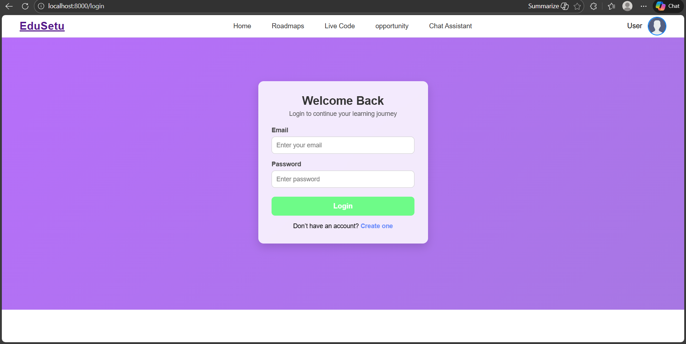
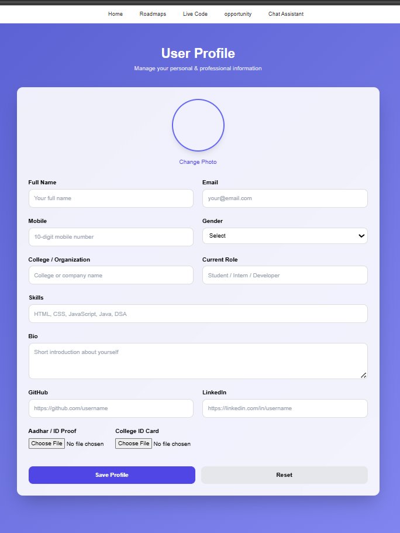
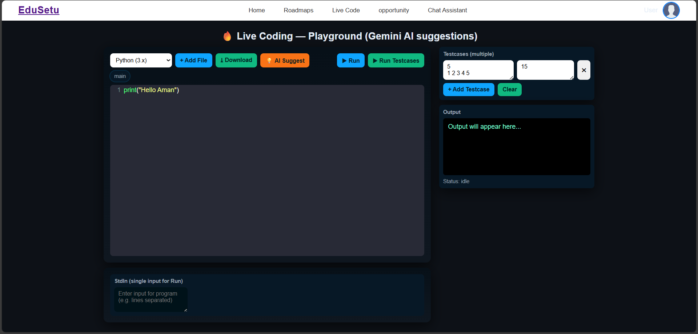
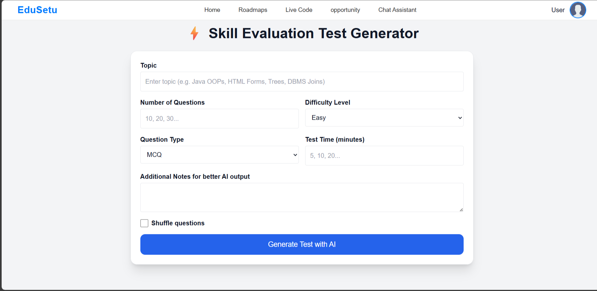
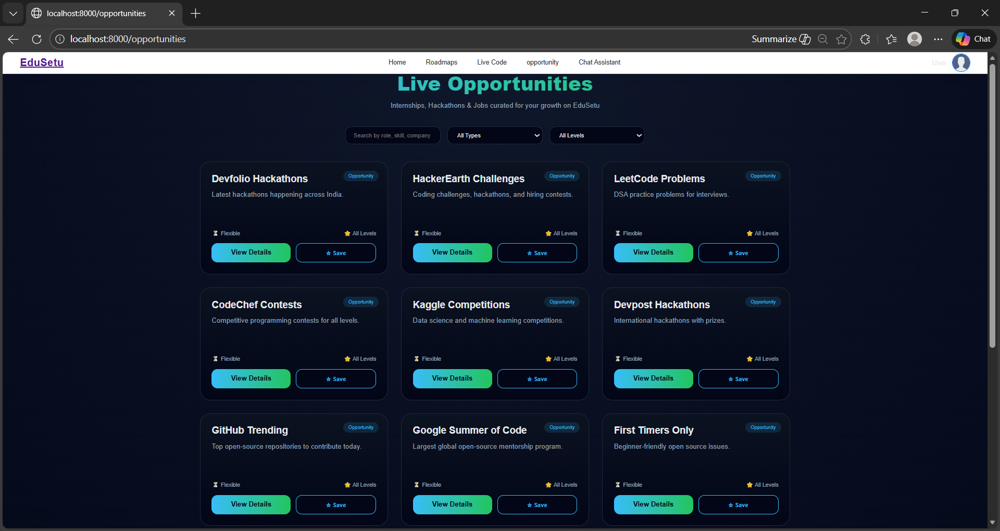
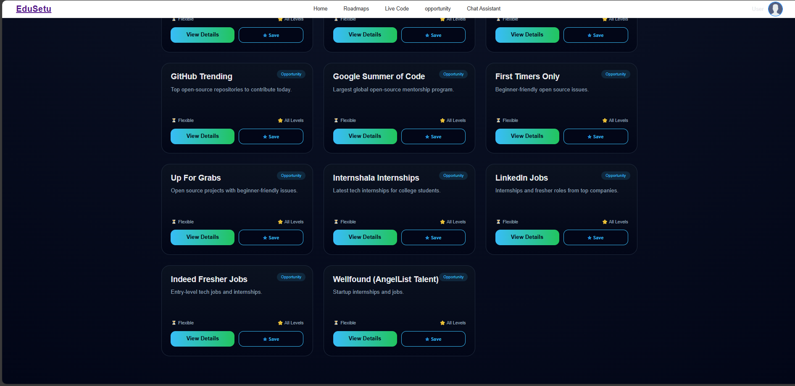
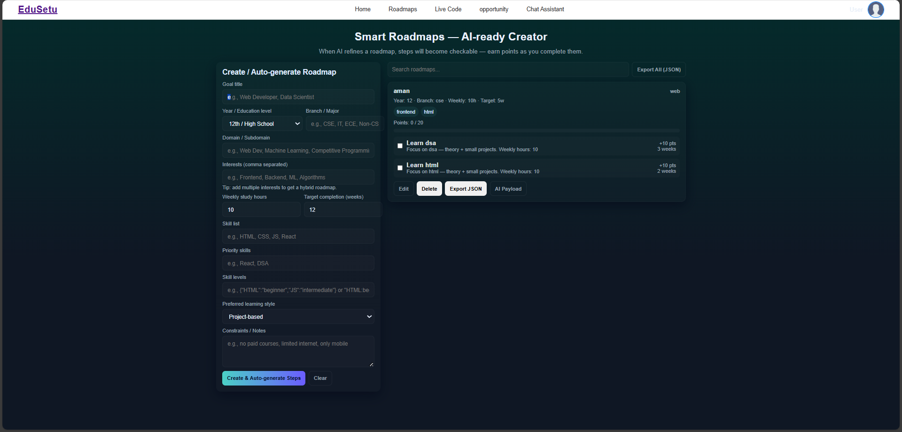

# 🎓 EduSetu – AI-Powered Career & Skill Bridge Platform

EduSetu is a full-stack web platform designed to bridge the gap between **students, skills, and career opportunities** using **Artificial Intelligence**.  
It provides personalized learning roadmaps, AI-generated quizzes, live coding practice, progress tracking, and real-time opportunities like hackathons and internships.

---

## 🚀 Features

- 🔐 **User Authentication** (Signup / Login)
- 🧠 **AI-Powered Career Guidance**
- 🗺️ **Personalized Learning Roadmaps**
- 📝 **AI MCQ Quiz Generator**
- 💻 **Live Coding Environment**
- 📊 **Skill Progress Tracking**
- 📈 **Success Prediction AI (Placement Readiness)**
- 🏆 **Hackathons, Internships & Open-Source Opportunities**
- 🎯 **Goal-Oriented Learning System**

---

## 🛠️ Tech Stack

### **Frontend**
- HTML
- CSS
- JavaScript
- EJS (Embedded JavaScript Templates)

### **Backend**
- Node.js
- Express.js

### **Database**
- MongoDB (Mongoose)

### **AI & APIs**
- Google Gemini API (AI features)
- Judge0 API (Live code execution – optional)
- RapidAPI (Opportunities integration – optional)

---

## 📁 Project Structure
```bash
EduSetu/
│
├── views/
│ ├── partials/
│ │ └── navbar.ejs
│ ├── home.ejs
│ ├── login.ejs
│ ├── signup.ejs
│ ├── dashboard.ejs
│ ├── roadmap.ejs
│ ├── progress.ejs
│ ├── chat.ejs
│ ├── opportunities.ejs
│ └── profile.ejs
│
├── public/
│ ├── css/
│ │ └── style.css
│ └── js/
│ └── main.js
│
├── controllers/
│ ├── authController.js
│ ├── roadmapController.js
│ ├── aiController.js
│ └── opportunitiesController.js
│
├── routes/
│ ├── authRoutes.js
│ ├── roadmapRoutes.js
│ ├── aiRoutes.js
│ ├── codeRoutes.js
│ └── opportunitiesRoutes.js
│
├── models/
│ ├── User.js
│ ├── Roadmap.js
│ └── Progress.js
│
├── server/
│ └── server.js
│
├── .env
├── package.json
└── README.md
```


## ⚙️ Installation & Setup

### 1️⃣ Clone the Repository
```bash
git clone https://github.com/amankv1234/EduSetu.git
```
```bash
cd EduSetu
```
### 2️⃣ Install Dependencies
```bash
npm install
```
### 3️⃣ Environment Variables
```bash
PORT=8000
MONGO_URI=your_mongodb_connection_string
```
```bash
GEMINI_API_KEY=your_gemini_api_key
RAPID_API_KEY=your_rapidapi_key
```
### 4️⃣ Run the Server
```bash
npm run dev
```
```bash
http://localhost:8000
```
## 🤖 AI Features Explained

AI Roadmap Generator
Generates a personalized learning roadmap based on user goals.

AI MCQ Quiz Generator
Automatically creates quizzes using Gemini AI.

Success Prediction AI
Predicts placement readiness using progress data and skill levels.

##  📸 Screenshots
###  🏠 Home Page
<p align="center">
  
</p>

### 🏠 Home Page
<p align="center">
  
</p>

### Singup
<p align="center">
  
</p>

### Login
<p align="center">
  
</p>

### Profile
<p align="center">
  
</p>

### Coding
<p align="center">
  
</p>

### Test
<p align="center">
  
</p>

### Dashboard
<p align="center">
  
</p>

### Chat Assistant 
<p align="center">
  
</p>

### Opportunity
<p align="center">
  
</p>

### Opportunity
<p align="center">
  
</p>

### Roadmap
<p align="center">
  
</p>

## 🔮 Future Enhancements

Resume analysis using AI

Mentor–student interaction

Mobile application

Advanced placement prediction model

Paid & free learning plans

## 👨‍💻 Author

Aman Kumar Vishwakarma
B.Tech – Computer Science & Engineering
📍 Uttar Pradesh, India

GitHub: https://github.com/amankv1234

## ⭐ Support

If you like this project, please ⭐ star the repository and share it with others.

## 📜 License

This project is developed for educational purposes.
